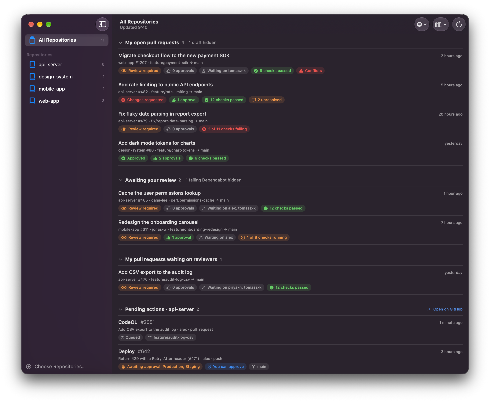
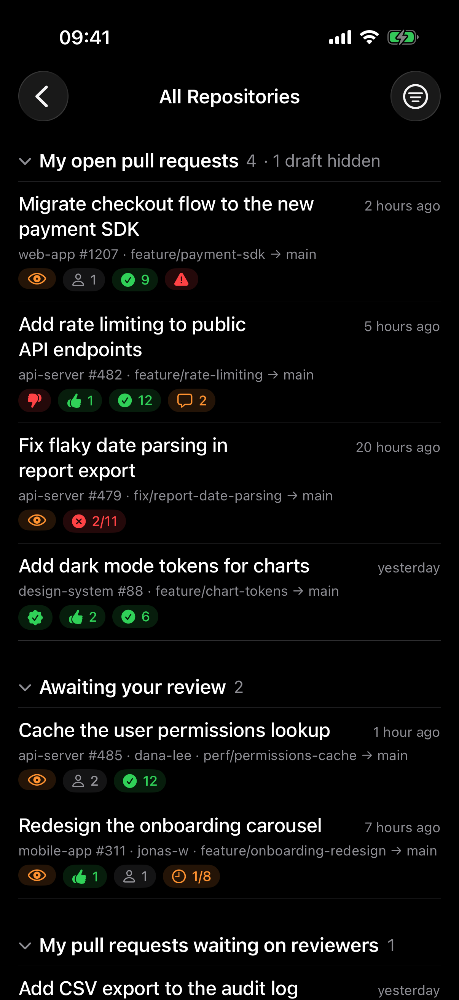

# GHDash

A small native dashboard, for macOS and iOS, for your GitHub work across the repositories you choose. The main goal of this application is to show everything that's waiting for you across repositories at a glance.

> This project is 100% vibe-coded: all of the code was written by Claude Code from conversational prompts.



*Screenshot of the demo mode, which shows made-up data.*

It shows:

- **My open pull requests** – with draft, review, approval, check, conflict and unresolved-thread status
- **Awaiting your review** – pull requests where your review is requested, plus Dependabot pull requests that nobody has been asked to review yet
- **My pull requests waiting on reviewers** – your pull requests with nothing left for you to do
- **Pending actions** – GitHub Actions runs that have not finished, including deployments waiting for approval

Every row opens the pull request or workflow run on GitHub; the app itself is read-only.

A sidebar scopes the dashboard to a single repository and shows item counts per repository. The Dock badge counts the things waiting on you: review requests, your pull requests that need fixing, and deployments you can approve. Data refreshes every three minutes.

## macOS

### Requirements

- macOS 15 or later
- Xcode and [XcodeGen](https://github.com/yonaskolb/XcodeGen) (`brew install xcodegen`)
- The [GitHub CLI](https://cli.github.com), logged in with `gh auth login`

The app gets its token by running `gh auth token` and stores no credentials itself, which is why it is not sandboxed. Setting `GH_TOKEN` in the app's environment overrides this.

### Build and run

```sh
make run      # build and open the app
make install  # copy it to /Applications
make demo     # open a second instance with made-up data, no GitHub login needed
```

On first launch, pick the repositories to show with **Choose Repositories…**.

## iOS



*The iPhone app in demo mode, which shows made-up data.*

The iPhone and iPad app shows the same dashboard as the Mac app: the same four sections, collapsible, with every row opening the pull request or workflow run on GitHub. It needs iOS 18 or later.

- **Repositories** – the dashboard opens on all repositories; the back button leads to the repository list with item counts, where you can scope to one repository, choose which repositories to show, or sign out. On an iPad that list is a sidebar.
- **Filters** – the filter button hides drafts, failing Dependabot pull requests, or all Dependabot pull requests, as the filter menu does on the Mac.
- **Refreshing** – pull down to refresh; the app also refreshes every three minutes while it is open.
- **Not on iOS** – notifications and an app-icon badge.

On an iPhone the status badges shrink to an icon and a number so that they fit on one line:

| Badge | Meaning |
|---|---|
| eye | review required |
| seal with a check mark | approved |
| thumbs down | changes requested |
| thumbs up and a number | approvals |
| person and a number | reviewers still to respond |
| check mark in a circle and a number | all checks passed |
| cross in a circle, e.g. 2/11 | failing checks out of the total |
| clock, e.g. 3/9 | checks still running out of the total |
| speech bubble and a number | unresolved review threads |
| warning triangle | merge conflicts |

An iPad has room for the full text, as on the Mac.

### Signing in

iOS has no GitHub CLI to borrow a login from, so you sign in by pasting a personal access token:

1. Create a classic token at <https://github.com/settings/tokens/new> with the `repo` scope, which is what lets the app read private repositories. Adding `read:org` is optional: it lets the app show the names of teams asked to review, which otherwise appear as "a team". The sign-in screen links to that page with both scopes filled in.
2. If an organisation uses single sign-on, authorise the token for it under **Configure SSO** on the token list.
3. Paste the token into the app.

The app checks the token with GitHub, then keeps it in the Keychain on the device. It is only ever sent to GitHub. **Sign Out** removes it.

A token is used rather than an OAuth sign-in because a third-party OAuth app has to be approved by an owner of every organisation whose repositories it should see.

### Build and run

```sh
make ios-run   # build, then install and launch in the iPhone simulator
make ios-demo  # the same, with made-up data and no sign-in
```

`IOS_DEVICE="iPad (A16)" make ios-run` picks another simulator. To run on a real device, open the project in Xcode and choose your team for the `GHDashMobile` target.

## Terminal

`ghdash` is the same dashboard for the terminal, built with [TermKit](https://github.com/migueldeicaza/TermKit): a repository list with item counts on the left, the four collapsible sections on the right, one line per pull request or workflow run with its badges, and a status bar with the hotkeys. It signs in through the GitHub CLI like the Mac app.

```sh
make tui-run      # build and run
make tui-demo     # run with made-up data
make install-tui  # copy to /usr/local/bin/ghdash
ghdash --repo owner/name --repo owner/other   # these repositories, for this run only
```

Keys: `j`/`k` or the arrows move, `Enter` opens the row on GitHub or folds a section, `Space` folds the section, `Tab` switches between the repository list and the dashboard, `r` refreshes, `d`, `b` and `B` toggle the filters (drafts, failing Dependabot, all Dependabot), `p` chooses repositories, `q` quits, and the menu bar (`F9`) has the same commands. Inside a [herdr](https://herdr.dev) pane the app reports itself as blocked while something is waiting on you and idle otherwise, so the pane list shows it without a badge. The terminal app keeps its own settings in `~/.config/ghdash/config.json`, separate from the Mac app's: its repositories, filters, folded sections and scope.

## Project

The Xcode project is generated from `project.yml`; run `make project` to open it in Xcode. The data layer shared by all three is in `Sources/Shared/Core`, the SwiftUI views shared by the two apps in `Sources/Shared/Views`, and `Sources/macOS`, `Sources/iOS` and `Sources/TUI` hold what differs. The terminal target pins TermKit to a commit, as it has no releases, and SwiftTerm to 1.11.2, the last release that builds without Apple's Metal toolchain. The app icons are drawn by `scripts/make-icon.swift`.
